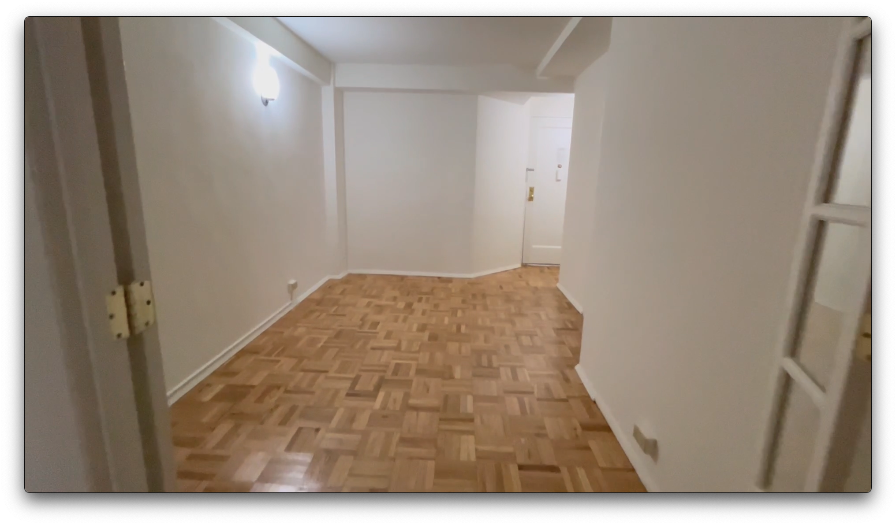

# Stuytown / East Village room available now

Looking for a room-mate for a large room in a 2 bed apartment in Stuytown/East Village.

$2600 for bedroom and separate work/desk area in a 2 bed apartment

Contact me at dc@rik.ai or 628-777-8813 with a bit of info about yourself and let's see if it's a fit.

On 14th st / Avenue B

- wonderful large room - 12' x 10'4"
- large window
- modern kitchen with dishwasher, microwave, gas stove etc
- AC/electricity/gas/wifi included
- laundry room in basement

Enjoy all the [luxury amenities](https://www.stuytown.com/amenities/) of the Stuytown community and the fun of the East Village!
- private pickle ball courts, coworking space, cafe, chess tables, movie nights, ice rink and more
- Right opposite Trader Joes and Target.
- Tompkins Square Park, St Marks and the L train to Brooklyn are within 5 minutes walk.

[I'm a software developer and designer, sometime artist](https://dc.rik.ai/) and work from home a few days a week.
Looking for a chill and responsible roommate perhaps doing something similar.

Please send a note with some info on yourself and let's see if it's a fit.

## Pix!

There is a KING size bed in the room now but the room size makes it seem small.
The room is 12' x 10'4" - very large for the east village.

Floor plan shows how big this apartment is compared to the normal east village apartments.
It's also very modern with fast elevators, laundry and a dishwasher.

There's a perfect nook area separated from the living room which can fit a 5' desk

Stuytown's [model room](https://www.stuytown.com/gallery/) for the same layout.

I just moved in so the rest of the apartment is in process of being furnished.

