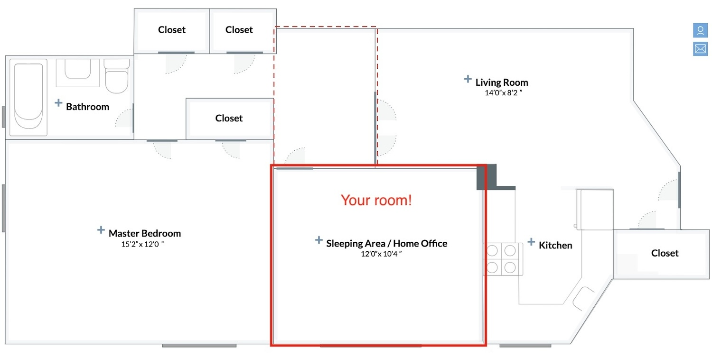

# Stuytown / East Village room available now

I'm Looking for a room-mate for a large room in the East Village.

$2500 for the bedroom and separate work/desk area in a 2 bed apartment

Contact me at <dc@rik.ai> or 628-777-8813 with a bit of info about yourself and let's see if it's a fit!

- wonderful large room - 12' x 10'4"
- large window
- modern kitchen with dishwasher, microwave, gas stove etc
- central AC/electricity/gas/wifi/heating included
- laundry room in basement

## Location

Address is [On 14th st / Avenue B](https://maps.app.goo.gl/zVDdf6zTLdg4CmE17)

Enjoy all the [luxury amenities](https://www.stuytown.com/amenities/) of the Stuytown community and the fun of the East Village!

- Private pickle ball courts, coworking space, cafe, chess tables, movie nights, ice rink, gyms, event space
- Right opposite Trader Joes and Target on 14th
- [CoWorking/Study space](https://www.stuytown.com/amenities/modern-conveniences/oval-study/)
- Tompkins Square Park, St Marks and the heart of the East Village 5 mins south
- Loads of east Village bars, restaurants and art spaces in the neighborhood.
- Union Square a few blocks to the West
- L train to be in Williamsburg/Brooklyn in 10 minutes!

I'm a middle aged [software developer and creative coder](https://dc.rik.ai/)
Looking for a chill, responsible person to share the space with.

Please send a note with some info on yourself and let's see if it's a fit.

## Pix

There is a KING size bed in the room now. The room could be provided with or without the bed.
The room is 12' x 10'4" - very large for the East Village.

Floor plan shows how big this apartment is compared to the normal east village apartments.
It's also very modern with fast elevators, laundry and a dishwasher.

There's a perfect nook area separated from the living room which can fit a 5' desk

Stuytown's [model room](https://www.stuytown.com/gallery/) for the same layout.

I just moved in so the rest of the apartment is in process of being furnished.

Entry. A Real living room - in the East Village!

Kitchen - has all the mod cons

## Stuytown amenities

[stuytown itself](https://www.stuytown.com/amenities/) is a small village community and has a bunch of things from cafes and chess tables to an ice skating rink in the winter! It's a really great and comfortable peaceful paradise and supportive community in the heart of Manhattan's intensity.

---

Contact me at <dc@rik.ai> or 628-777-8813 with a bit of info about yourself and let's see if it's a fit!
