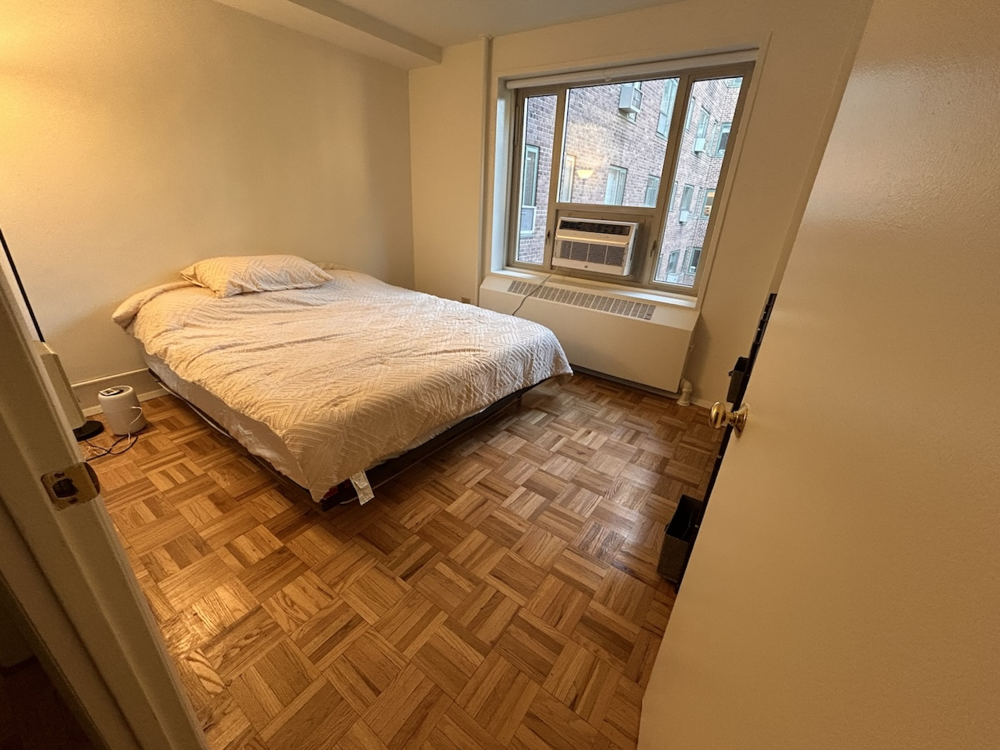
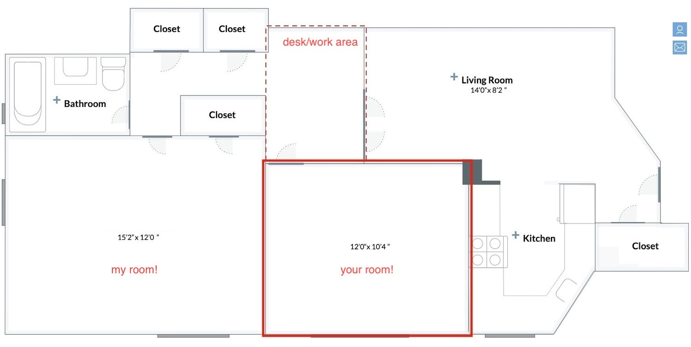
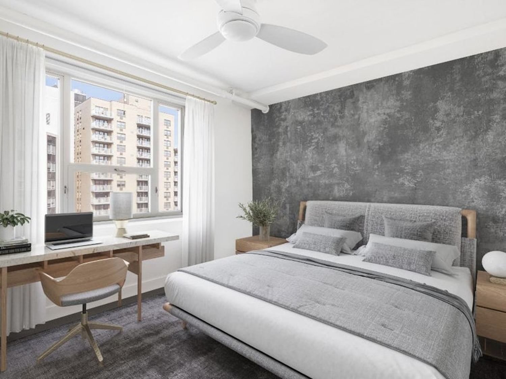
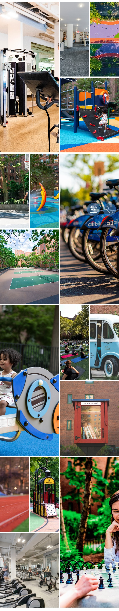
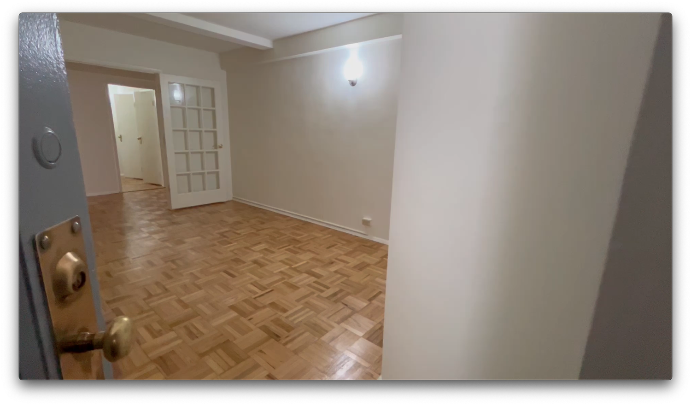
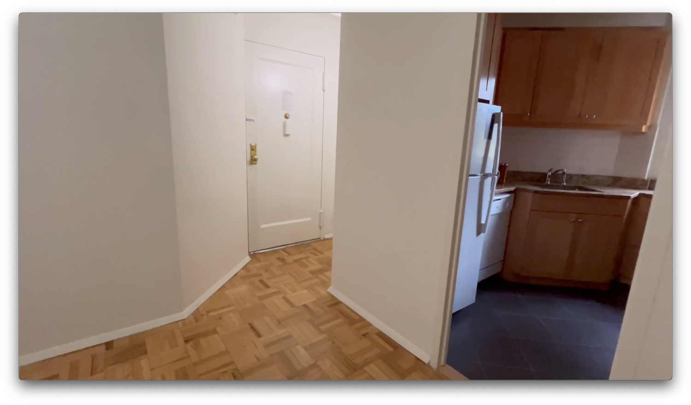
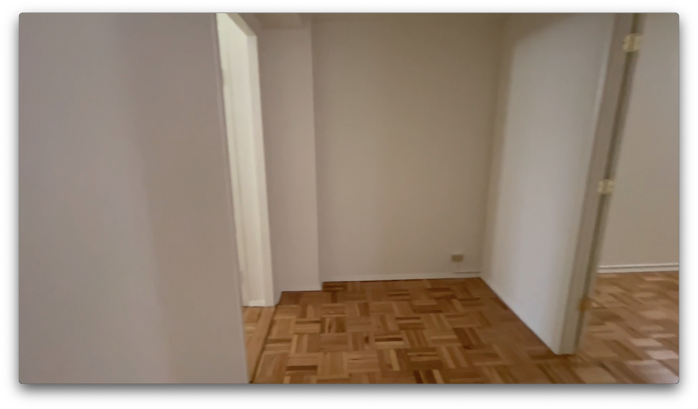

# East Village Room available now

I'm looking for a roommate for my east village / Stuytown apartment.
14th st and Avenue B

massive room in a 2BR
The Stuytown village  has pickleball courts, ice skating rink lots of gyms, co-working space, cafes.
An oasis in the heart of the East Village and a few steps to Union Square.

Currently has a KING size bed but even then plenty of space.
There's a separate work area too!
$2500 all in

I just moved in and in the process of buying furniture!
I'm a software developer and work from home some of the time. Looking for someone professional and chill to share with

ping me here or <dc@rik.ai> with a bit of info and let's see if it's a fit!

more info and pix
<https://dcsan.github.io/stuytown/>

